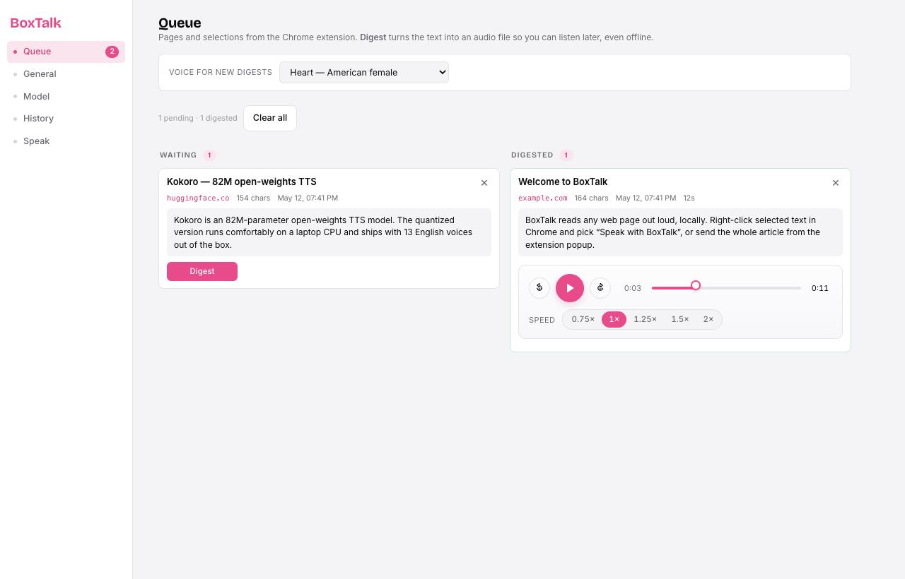
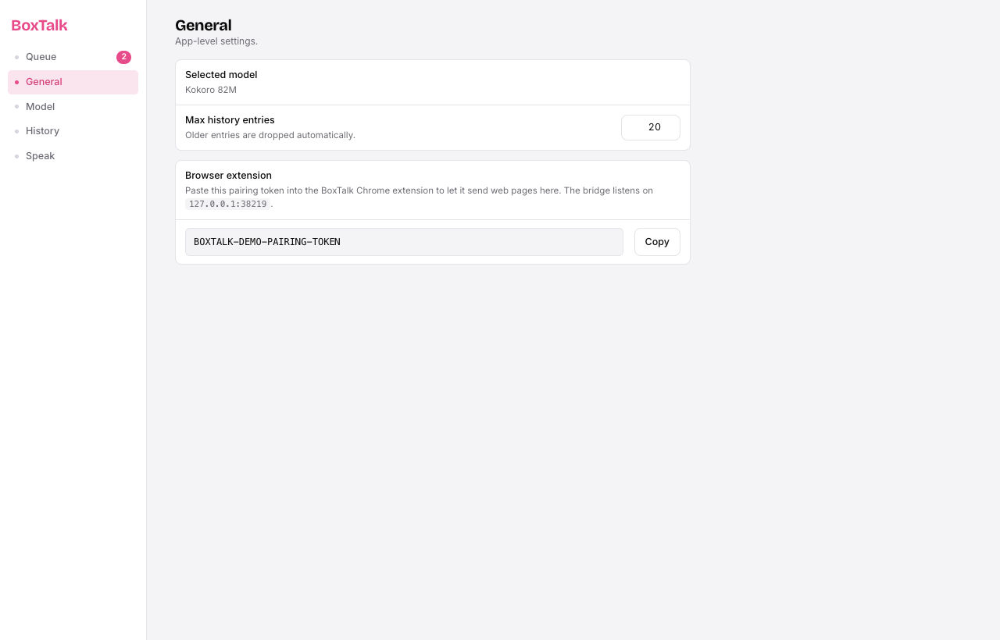
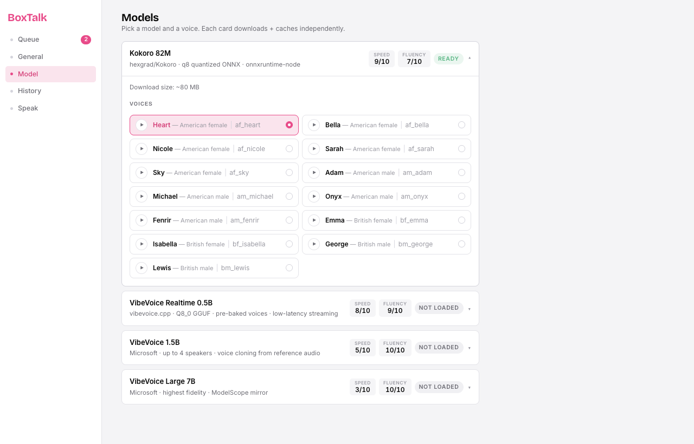
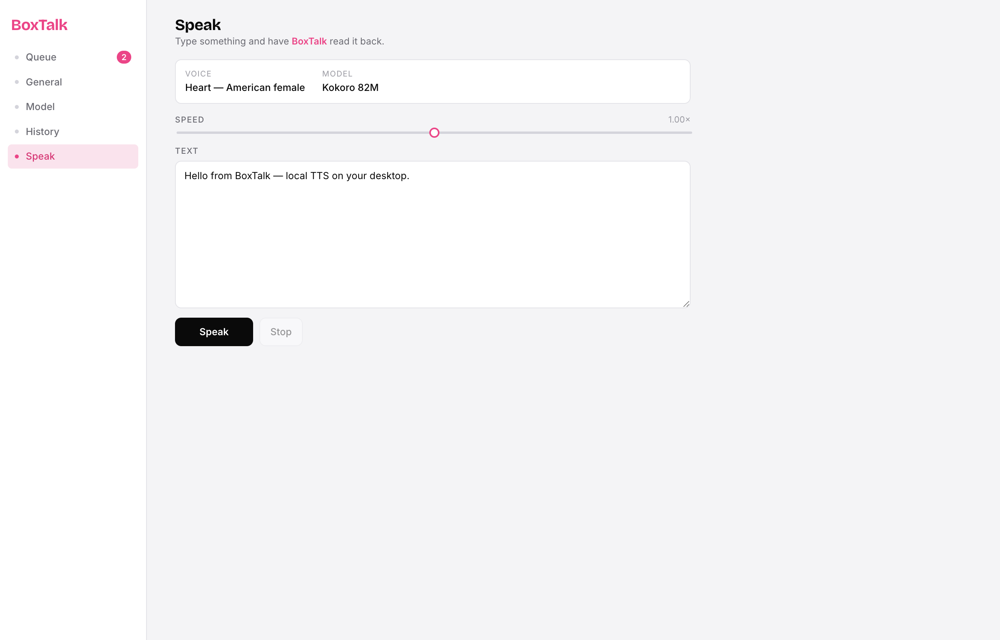

# BoxTalk

Local text-to-speech on your desktop, paired with a Chrome extension that pipes any web page (or selected text) to it. Powered by [Kokoro](https://github.com/hexgrad/kokoro) — an 82M-parameter open-weights TTS model — running entirely on your machine via `onnxruntime-node`. No cloud round-trip, no API key, no telemetry. Ships with an optional second engine ([VibeVoice](https://github.com/localai-org/vibevoice.cpp)) for higher-fidelity playback and voice cloning; see [Engines](#engines) below. English only for now; the models support other languages and they're on the roadmap.



## Why

Most "read this article aloud" tools either ship audio to a cloud API or use the OS's built-in voices. BoxTalk does neither: it runs Kokoro locally so your reading list never leaves your laptop, and the voices are dramatically better than `say` / SAPI / espeak. The Chrome extension is the glue — you keep browsing, you queue or speak from the page you're on, and BoxTalk handles synthesis, playback, and history.

## Two pieces

```
┌──────────────────────────┐                    ┌───────────────────────────┐
│  Chrome extension (MV3)  │  HTTP + token      │   BoxTalk desktop app     │
│  • right-click selection │ ─────────────────▶ │   • Kokoro TTS engine     │
│  • whole-page popup      │  127.0.0.1:38219   │   • Queue + History       │
│  • Cmd/Ctrl+Shift+S      │                    │   • Local SQLite store    │
└──────────────────────────┘                    └───────────────────────────┘
```

Both halves, plus the marketing site, live in this monorepo:

```
apps/
  desktop/     Electron + React desktop app (TTS engine + UI)
  extension/   MV3 Chrome extension (selection / page → desktop bridge)
  sites/
    landing/   Astro marketing site (boxtalk.dev)
```

## Install

### 1. Get the desktop app

**Pre-built release (recommended)** — grab the latest DMG from the [Releases](../../releases) page, drag BoxTalk.app into Applications, and launch it. First launch downloads the quantized Kokoro model (~80 MB) from Hugging Face; every launch after that runs offline.

**From source** — if you want to hack on the app or there's no release for your platform yet:

```bash
pnpm install
pnpm start        # builds the renderer and launches Electron
```

You'll need Node 20+ and [pnpm](https://pnpm.io/). To produce a distributable DMG:

```bash
pnpm dist:mac     # writes apps/desktop/release/*.dmg
```

### 2. Load the Chrome extension

The extension isn't on the Chrome Web Store yet — load it as an unpacked extension:

1. Open `chrome://extensions` and toggle **Developer mode** on.
2. Click **Load unpacked** and pick `apps/extension/` from this repo.
3. In the BoxTalk app, open **General → Browser extension** and copy the pairing token.
4. Click the extension's toolbar icon → **Settings** → paste the token → **Save**.

The popup's status dot should turn green when it can reach the desktop app.

## How the two halves talk

The desktop app runs a minimal HTTP server on `http://127.0.0.1:38219` — loopback only, never bound to a public interface. Every mutating request must carry an `X-BoxTalk-Token: <pairing-token>` header. The token is a 24-byte random string generated on first launch and stored in the app's local SQLite database. It surfaces in **General → Browser extension** so you can paste it into the extension's settings page.

The bridge exposes three endpoints:

| Endpoint           | Auth   | What it does                                                                                |
| ------------------ | ------ | ------------------------------------------------------------------------------------------- |
| `GET  /status`     | none   | Health check. Returns `{ ok, kokoro }` so the extension can render its connection dot.       |
| `POST /speak`      | token  | "Read this now." The app focuses, chunks the text sentence-by-sentence, and plays it.        |
| `POST /candidates` | token  | "Save this for later." Inserts a row into the Queue (Waiting column). The app stays quiet.   |

The extension never opens an arbitrary host. Its only host permission is `http://127.0.0.1:38219/*`. Without the desktop app running on loopback nothing happens — there's no fallback path.



## Using the extension

There are two modes and two actions, which cross-multiply to four flows. All of them post text from the active tab to the desktop app.

- **Selection** — highlight text on any page, then either right-click → "Speak with BoxTalk", press `Cmd/Ctrl+Shift+S`, or open the popup's *Selection* tab.
- **Whole page** — open the popup's *Whole page* tab. The extension runs Mozilla [Readability](https://github.com/mozilla/readability) on a clone of the live DOM (same algorithm as Firefox Reader View) and shows the article body so you can edit or trim before sending.

For each mode you can choose:

- **Speak now** → `/speak`. The desktop app jumps to the front and starts reading.
- **Save for later** → `/candidates`. Lands silently in the Queue with the source URL and page title.

Long pages are chunked by the desktop app and played back-to-back — each chunk is also written to the History tab tagged with the source URL.

## The Queue


The Queue is the first screen you land on, because it's where saved-for-later pages live. Pick the **voice** for new digests at the top of the page — the choice is persisted, and "Heart" is the default. Hit *Digest* on a waiting card and the desktop app chunks the text, synthesizes each chunk through Kokoro, merges the Float32 samples into one WAV, and writes the file to the app's user-data dir (`userData/digests/<id>.wav`). Playback after that is instant and works without the model loaded.

Once digested, a card moves to the right-hand *Digested* column and reveals a self-contained transport panel:

- **Skip back 30s** · **Play / Pause** · **Skip forward 30s** — circular icon buttons.
- A draggable **seek bar** with a hover tooltip that surfaces the `m:ss` you'd jump to. The played portion fills in pink as audio progresses.
- A **playback-speed segmented control** (`0.75× · 1× · 1.25× · 1.5× · 2×`). The chosen speed drives `audio.playbackRate` live — no re-synthesis — and the setting persists across plays. Digest itself always renders at 1.0×; speed is a listening preference, not a synthesis parameter.

## The other views

| View          | What it does                                                                                                            |
| ------------- | ----------------------------------------------------------------------------------------------------------------------- |
| **Queue**     | Pages + selections from the extension. Pick the voice at the top, *Digest* to render, then a full transport per card.   |
| **General**   | App-level settings: selected model, history retention, and the pairing token.                                            |
| **Model**     | Live model status. Kokoro 82M loads automatically on first launch (~80 MB download, then cached).                        |
| **History**   | Every synthesis recorded, with text, voice, source, timestamp, duration. Live search + clear.                            |
| **Speak**     | Free-form text input. Type, pick speed, hit Speak.                                                                       |





## Engines

BoxTalk ships with two TTS engines. Kokoro is on by default; VibeVoice is opt-in.

### Kokoro 82M (default)

82M-parameter open-weights model from [hexgrad/Kokoro](https://github.com/hexgrad/kokoro), running through `kokoro-js` + `onnxruntime-node`. Quantized to q8 ONNX, ~80 MB download, comfortable on a laptop CPU. Ships with **13 English voices** — American + British, female + male. Listed in the **Model** card; click the play button on any row to preview the voice, the radio dot to make it the default.

### VibeVoice (optional, higher fidelity)

[`vibevoice.cpp`](https://github.com/localai-org/vibevoice.cpp) — a C++ port of Microsoft VibeVoice that runs on CPU via GGUF weights. Three model sizes are surfaced in the UI:

| Model                       | Size    | What you get                                                  | Status                                                              |
| --------------------------- | ------- | ------------------------------------------------------------- | ------------------------------------------------------------------- |
| **VibeVoice Realtime 0.5B** | ~2 GB   | Pre-baked Carter + Emma voices, low-latency streaming         | Supported — GGUFs published on Hugging Face, downloads on demand    |
| **VibeVoice 1.5B**          | ~6 GB   | Up to 4 speakers, voice cloning from reference audio          | Requires manual conversion of upstream weights                       |
| **VibeVoice Large 7B**      | ~14 GB  | Highest fidelity, ModelScope mirror                           | Requires manual conversion of upstream weights                       |

VibeVoice is entirely on-demand. Nothing about it ships in the DMG. The first time you click *Load* on **VibeVoice Realtime 0.5B** in the **Model** tab, BoxTalk pulls two things into the app's user-data dir:

1. **`vibevoice-cli`** — a prebuilt binary for your platform+arch, downloaded from the matching BoxTalk release asset (e.g. `vibevoice-cli-darwin-arm64`). Cached at `<userData>/vibevoice/bin/vibevoice-cli`.
2. **The GGUF weights** (~2 GB) — pulled from `mudler/vibevoice.cpp-models` on Hugging Face. Cached at `<userData>/vibevoice/models/`.

If no prebuilt is published for your platform yet (or you're offline), BoxTalk falls back to cloning + compiling `localai-org/vibevoice.cpp` locally — requires Xcode Command Line Tools or your platform's equivalent (`git`, `cmake`, `make`).

To build the CLI manually for development:

```bash
pnpm build:vibevoice   # clones localai-org/vibevoice.cpp into vendor/ and builds
```

The 1.5B and 7B cards show a friendly error until you point them at converted weights (see `apps/desktop/vibevoice.js`).

## Tests

```bash
pnpm smoke    # all 13 voices generate a WAV
pnpm e2e      # full UI flow via Playwright + Electron
pnpm test     # smoke + e2e
```

See `apps/desktop/README.md` for what each test covers, and `apps/extension/README.md` for loading + debugging the extension.

## Roadmap

- [x] Chrome extension that captures selected text / page content and pipes it to this app.
- [x] Queue view with a per-card digest-then-listen workflow.
- [x] Always-visible playback transport on digested cards: pause/resume, ±30s skip, draggable seek with hover tooltip, live playback-speed control.
- [x] Optional second engine: VibeVoice (vibevoice.cpp) — Realtime 0.5B working today, 1.5B + 7B pending GGUF availability.
- [ ] More languages — Kokoro supports Japanese, Mandarin, Spanish, French, Hindi, Italian, Portuguese.
- [ ] "Summarize then read" mode driven by a local LLM in the extension.

## Landing site

The marketing site lives at `apps/sites/landing/` (Astro + Tailwind). It deploys to **Cloudflare Pages** as project `boxtalk` — currently reachable at https://boxtalk.pages.dev/.

`.github/workflows/deploy-landing.yml` redeploys whenever:

- `apps/sites/landing/**` (or the lockfile / workflow file) changes on `main`
- A GitHub release is published — so the landing's build-time fetch of `releases/latest` picks up the new version + DMG link

For CI deploys you need two repo secrets (Settings → Secrets and variables → Actions):

| Secret                  | Value                                                                                            |
| ----------------------- | ------------------------------------------------------------------------------------------------ |
| `CLOUDFLARE_API_TOKEN`  | Create at https://dash.cloudflare.com/profile/api-tokens with the **Cloudflare Pages — Edit** template (or a custom token with `Account.Cloudflare Pages: Edit`), scoped to the *Accomplish* account. |
| `CLOUDFLARE_ACCOUNT_ID` | `ab43a89c284963fce47460305a945611` (run `wrangler whoami` to reconfirm)                          |

Deploy manually from a local checkout with:

```bash
pnpm -F @boxtalk/site build
npx wrangler pages deploy apps/sites/landing/dist --project-name=boxtalk --branch=main
```

To attach the `boxtalk.dev` custom domain, first add the zone to Cloudflare (Add Site flow), then in the Pages dashboard go to *boxtalk → Custom domains → Set up a custom domain → boxtalk.dev*.

## Releasing

Tag pushes trigger the macOS release build via `.github/workflows/release.yml`:

```bash
# Bump version in apps/desktop/package.json first, then:
git tag v0.1.0
git push origin v0.1.0
```

CI runs on `macos-latest`, builds the unsigned DMG via `pnpm -F @boxtalk/app dist:mac`, and uploads it to a GitHub release named after the tag. The landing site (`apps/sites/landing`) reads `releases/latest` at build time and links the DMG directly. To dry-run the build without publishing, use the workflow's `workflow_dispatch` trigger.

The build is unsigned (`identity: null` in electron-builder config), so first-launch users need to right-click the app → *Open*, or run `xattr -dr com.apple.quarantine /Applications/BoxTalk.app`.

## License

MIT.
